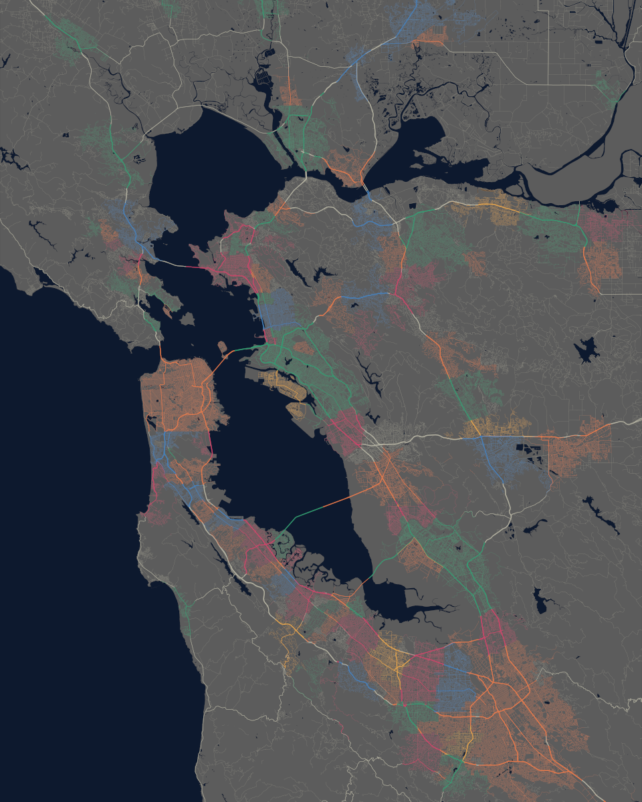

Bay Area Road Map
================

  - [Overview](#overview)
  - [Parameters](#parameters)
      - [data\_subfolder](#data_subfolder)
      - [county\_fips\_codes](#county_fips_codes)
      - [state\_fips\_codes](#state_fips_codes)
      - [image\_dimensions](#image_dimensions)
      - [image\_lat and image\_lon](#image_lat-and-image_lon)
      - [road\_thickness](#road_thickness)

## Overview

This script generates a road map of the San Francisco Bay Area using
only ggplot2, magick, and freely available data provided by the US
Census Bureau’s TIGER/Line geodatabases. It includes the coastline, all
bodies of water, and all paved roads, with the roads colored as they
pass through municipal city boundaries.

## Parameters

Because everything here is generated programmatically, it’s all entirely
adjustable. I’ve created a set of user-adjustable parameters in a
section near the top of the script for ease of use.

### data\_subfolder

This script automatically fetches all necessary data from the Census
Bureau and saves and unpacks everything in a subfolder. By default, this
is a subfolder in the working directory named “data”, but this can be
changed if needed.

### county\_fips\_codes

Data for area hydrography and road paths are organized by TIGER/Line in
separate files for each county. This script can be used to plot
different areas of the country by supplying a different vector of files
to download. A list of county FIPS codes in the United States can be
found
[here](https://www.nrcs.usda.gov/wps/portal/nrcs/detail/national/home/?cid=nrcs143_013697).

### state\_fips\_codes

Unlike the water and road data, city boundary data is organized by
state. A list of state FIPS codes can be found
[here](https://www.nrcs.usda.gov/wps/portal/nrcs/detail/?cid=nrcs143_013696).

### image\_dimensions

By default, this script generates a 9600 by 12000 pixel image, only
because that results in a 24 by 30 inch image at 400dpi. This can be
adjusted to any dimension size, but note that if this is dramatically
increased, it can result in pretty lengthy plot times.

### image\_lat and image\_lon

These two parameters control the latitude and longitude of the plotted
geographic area.

### road\_thickness

This parameter is a numeric vector of length 2 because it directly feeds
into the ggplot2::scale\_size() plotting function, telling ggplot2 how
thick to plot the thinnest and thickest styles of roads on the map,
respectively. All intermediate road styles will be scaled to match the
range given here. If the image\_dimensions parameter is changed, this
may have to be adjusted as well.
